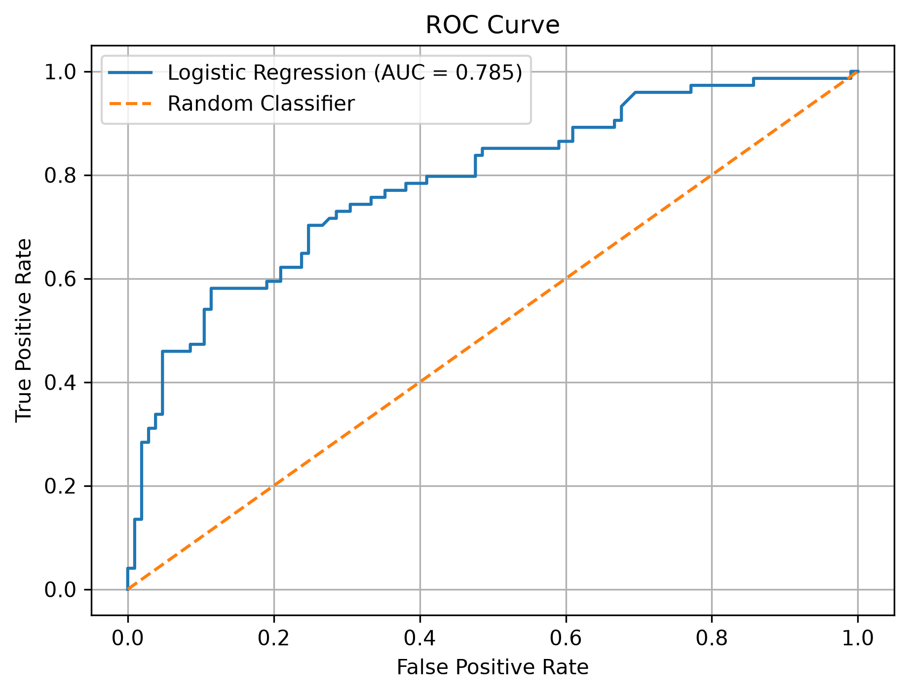

# Titanic Logistic Regression

## Project Overview

This project applies Logistic Regression to the Titanic dataset to predict passenger survival.

The project covers the complete Logistic Regression workflow, including preprocessing, regularization, cross-validation, hyperparameter tuning, class balancing, and model evaluation.

## Dataset

The project uses the Titanic training dataset:

`data/train.csv`

### Features Used

* Pclass
* Age
* SibSp
* Parch
* Fare

### Target

* `Survived`

  * 0 → Did not survive
  * 1 → Survived

## Machine Learning Workflow

1. Load the Titanic dataset
2. Select features and target
3. Handle missing Age values
4. Split data into training and testing sets
5. Apply StandardScaler
6. Train Logistic Regression
7. Evaluate the model
8. Analyze model coefficients
9. Apply L1 regularization
10. Apply L2 regularization
11. Apply Elastic Net regularization
12. Perform 5-fold cross-validation
13. Build a Scikit-learn Pipeline
14. Tune the `C` hyperparameter using GridSearchCV
15. Handle class imbalance using `class_weight="balanced"`
16. Evaluate the final model
17. Generate an ROC Curve

## Model Evaluation

The project evaluates the model using:

* Accuracy
* Precision
* Recall
* F1 Score
* ROC-AUC
* Log Loss
* Confusion Matrix
* Classification Report

## Results

### Logistic Regression

* Accuracy: **73.18%**
* ROC-AUC: **~0.785**

### Cross-Validation

* 5-Fold Mean CV Accuracy: **68.83%**

### GridSearchCV

* Best C: **10**
* Best CV Accuracy: **68.97%**
* Test Accuracy: **72.63%**

### Balanced Logistic Regression

* Test Accuracy: **72.63%**
* Precision: **65.82%**
* Recall: **70.27%**
* F1 Score: **67.97%**

The balanced model improved recall for the survivor class, showing that class weighting can help the model identify more minority-class examples.

## ROC Curve



## Technologies Used

* Python
* Pandas
* Scikit-learn
* Matplotlib

## How to Run

Install the required libraries:

```bash
pip install pandas scikit-learn matplotlib
```

Run the project:

```bash
python ml_titanic.py
```

The program trains the models, evaluates their performance, and generates the ROC curve.

## Key Concepts Practiced

* Binary Classification
* Logistic Regression
* Sigmoid Probability
* Classification Threshold
* Log Loss
* Model Coefficients
* Feature Scaling
* L1 Regularization
* L2 Regularization
* Elastic Net
* Cross-Validation
* Pipeline
* GridSearchCV
* Hyperparameter Tuning
* Class Imbalance
* Confusion Matrix
* Precision, Recall and F1 Score
* ROC Curve and ROC-AUC
